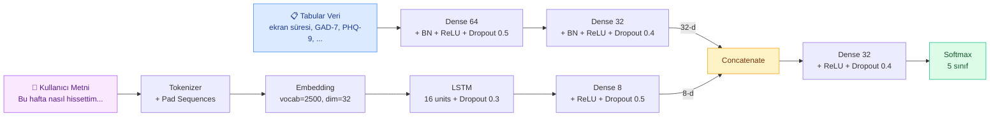

# 🧠 Sosyal Medya Bağımlılık Dedektörü

> Multi-modal derin öğrenme ile sosyal medya bağımlılığı tespiti ve kişiselleştirilmiş ruh sağlığı raporu üretimi.


---

## 📋 İçindekiler

- [Proje Hakkında](#-proje-hakkında)
- [Özellikler](#-özellikler)
- [Mimari](#-mimari)
- [Teknolojiler](#-teknolojiler)
- [Kurulum](#-kurulum)
- [Kullanım](#-kullanım)
- [Proje Yapısı](#-proje-yapısı)
- [Model Detayları](#-model-detayları)
- [Veri Seti](#-veri-seti)
- [Akademik Notlar](#-akademik-notlar)
- [Sorumluluk Reddi](#️-sorumluluk-reddi)

---

## 🎯 Proje Hakkında

Bu proje, **derin öğrenme** kullanarak kullanıcıların sosyal medya bağımlılık seviyesini tahmin eden ve kişiselleştirilmiş bir ruh sağlığı raporu üreten interaktif bir web uygulamasıdır. **Tabular veriler** (ekran süresi, klinik anksiyete/depresyon skorları, demografik bilgiler) ve **doğal dil metni** (kullanıcının haftalık his ifadeleri) iki ayrı sinir ağı dalında işlenir, ardından birleştirilerek tek bir tahmin üretilir.

Model, kullanıcıyı 5 seviyede sınıflandırır:

| Seviye | Etiket | Açıklama |
|:---:|:---|:---|
| 1 | ✅ Sağlıklı | Dengeli kullanım, risk yok |
| 2 | 🟡 Dikkatli | Küçük risk işaretleri |
| 3 | 🟠 Risk Altında | Belirgin bağımlılık riski |
| 4 | 🔴 Bağımlılık Başlıyor | Ciddi uyarı, uzman önerilir |
| 5 | 🚨 Ciddi Bağımlılık | Profesyonel destek gerekli |

---

## ✨ Özellikler

- 🧠 **Multi-modal mimari**: Tabular MLP + Metin LSTM dalları, late fusion ile birleştirilir
- 💬 **NLP entegrasyonu**: Türkçe metni Tokenizer + Embedding + LSTM ile işler
- 📊 **Kapsamlı ruh sağlığı raporu**: Klinik şiddet sınıflandırması (GAD-7, PHQ-9), davranış örüntüsü analizi, kişiselleştirilmiş öneriler
- 🎨 **Şık Türkçe arayüz**: Gradio tabanlı, segmentlere ayrılmış form yapısı
- 🔬 **Branch ablation testi**: Her dalın katkısı ölçülür ve raporlanır
- 🛡️ **Güçlü regularization**: Veri sızıntısını önleyen olasılıksal etiket gürültüsü, text dropout augmentation, GaussianNoise
- 📞 **Acil destek bilgisi**: Yüksek risk durumunda profesyonel destek kaynaklarını gösterir

---

## 🏗️ Mimari



### Tasarım Prensipleri

1. **Tabular branch baskın**: 32-d temsil üretir; klinik ve davranışsal sinyaller ana karar mekanizmasıdır.
2. **Text branch yardımcı**: 8-d temsil üretir; kullanıcı dilindeki duygusal sinyalleri yakalar.
3. **Late fusion**: İki branch ortak temsil uzayında concatenate edilir, ardından ortak sınıflandırıcıya gider.
4. **Veri sızıntısı önleme**: Metin etiketleri olasılıksal duygu eşlemesi ile üretilir (deterministik değil).

---

## 🛠️ Teknolojiler

| Kategori | Kütüphane | Görev |
|:---|:---|:---|
| **Derin Öğrenme** | TensorFlow / Keras | Multi-modal model |
| **NLP** | Keras Tokenizer + LSTM | Metin işleme |
| **Veri** | Pandas, NumPy | Veri manipülasyonu |
| **ML Pipeline** | scikit-learn | Encoding, scaling, splitting |
| **Görselleştirme** | Matplotlib, Seaborn | Eğitim grafikleri |
| **Web UI** | Gradio | Etkileşimli arayüz |

---

## 🚀 Kurulum

### Gereksinimler

- Python 3.10+
- pip (veya conda)
- ~2 GB disk alanı (TensorFlow için)

### Adım 1: Repoyu klonla

```bash
https://github.com/polatcangurbuz/Social-Media-Addiction-Detector.git
cd Social-Media-Addiction-Detector
```

### Adım 2: Sanal ortam oluştur

```bash
python -m venv venv
source venv/bin/activate    # Linux/Mac
venv\Scripts\activate       # Windows
```

### Adım 3: Bağımlılıkları yükle

```bash
pip install -r requirements.txt
```

`requirements.txt` içeriği:

```
tensorflow>=2.15.0
gradio>=4.0.0
pandas>=2.0.0
numpy>=1.24.0
scikit-learn>=1.3.0
matplotlib>=3.7.0
seaborn>=0.12.0
```

---

## 💻 Kullanım

### 1️⃣ Modeli eğit

```bash
python train_model.py
```

Bu komut:
- Sentetik veri seti üretir (1000 örnek, gerçek Kaggle verisi yoksa)
- Multi-modal modeli eğitir (~80 epoch, EarlyStopping ile)
- Test seti üzerinde değerlendirir
- Eğitim grafiklerini ve confusion matrix'i kaydeder
- Tüm artifact'leri (model, scaler, tokenizer, encoders, config) diske yazar

**Çıktı dosyaları:**
- `addiction_model.keras` — Eğitilmiş model
- `scaler.pkl` — Tabular özellik scaler'ı
- `label_encoders.pkl` — Kategorik değişken encoder'ları
- `tokenizer.pkl` — Metin tokenizer'ı
- `feature_cols.json` — Özellik kolonları
- `config.json` — Model konfigürasyonu (max_seq_len, vocab_size, vb.)
- `training_results.png` — Accuracy/Loss/Confusion Matrix grafiği

### 2️⃣ Web arayüzünü başlat

```bash
python app_gradio.py
```

Tarayıcıda `http://localhost:7860` adresini aç. Anketi doldurup duygularını yazdığında detaylı bir ruh sağlığı raporu üretilir.

---

## 📁 Proje Yapısı

```
Social-Media-Addiction-Detector/
│
├── train_model.py           # Eğitim pipeline'ı
├── app_gradio.py            # Gradio web arayüzü
├── requirements.txt         # Python bağımlılıkları
├── README.md                # Bu dosya
│
├── artifacts/               # Eğitim çıktıları (otomatik üretilir)
│   ├── addiction_model.keras
│   ├── scaler.pkl
│   ├── label_encoders.pkl
│   ├── tokenizer.pkl
│   ├── feature_cols.json
│   ├── config.json
│   └── training_results.png

```

---

## 🔬 Model Detayları

### Hiperparametreler

| Parametre | Değer | Açıklama |
|:---|:---:|:---|
| `MAX_SEQ_LEN` | 30 | Maksimum metin token uzunluğu |
| `VOCAB_SIZE` | 2500 | Vocabulary boyutu |
| `EMBED_DIM` | 32 | Embedding boyutu |
| `LSTM_UNITS` | 16 | LSTM gizli birim sayısı |
| `TEXT_DROPOUT_RATE` | 0.30 | Eğitim sırasında metin sıfırlama oranı |
| `Batch Size` | 32 | Eğitim batch boyutu |
| `Learning Rate` | 5e-4 | Adam optimizer öğrenme oranı |
| `L2 Regularization` | 1e-3 | Tüm Dense ve LSTM katmanlarında |
| `Max Epochs` | 80 | EarlyStopping ile durdurulabilir |

### Eğitim Stratejileri

- **Class weights**: Dengesiz sınıflar için `sklearn.utils.class_weight` ile hesaplanır
- **EarlyStopping**: `val_loss` 15 epoch boyunca iyileşmezse durdurur, en iyi ağırlıkları geri yükler
- **ReduceLROnPlateau**: `val_loss` plateau yaparsa öğrenme oranını yarıya düşürür
- **ModelCheckpoint**: En iyi `val_accuracy`'ye sahip modeli kaydeder

### Branch Ablation Testi

Eğitim sonunda her branch'in katkısı ölçülür:

```
🔬 Branch Ablation Testi:
   Tam model:           0.8X
   Sadece tabular:      0.7X    ← LSTM kapalı (text=zeros)
   Sadece text:         0.4X    ← Tabular kapalı (tab=zeros)
   LSTM marjinal katkı: +X.X%
```

Bu, multi-modal yaklaşımın gerçekten katkı sağladığını ve hiçbir branch'in tek başına dominant olmadığını kanıtlar.

---

## 📊 Veri Seti

### Birincil veri kaynağı

Proje, [Social Media and Mental Health (Kaggle)](https://www.kaggle.com/) veri setiyle uyumlu çalışır. Şu kolonları bekler:

- `Daily_Screen_Time_Hours`, `Late_Night_Usage`, `Sleep_Duration_Hours`
- `GAD_7_Score` (anksiyete, 0-21), `PHQ_9_Score` (depresyon, 0-27)
- `User_Archetype`, `Dominant_Content_Type`, `Activity_Type`, `Primary_Platform`
- `Social_Comparison_Trigger`

### Sentetik veri (fallback)

Veri seti bulunamazsa `train_model.py` otomatik olarak 1000 örneklik **sentetik veri** üretir. Bu veri:
- 4 kullanıcı arketipi (Hyper-Connected, Passive Scroller, Average User, Digital Minimalist)
- Her arketipin kendine özgü özellik dağılımı
- %15 "atipik" örnek (gerçekçi outlier'lar)
- Klinik tabanlı (DSM-5 esinli) bağımlılık skoru hesaplaması

### Sentetik metin üretimi

Her satır için **olasılıksal duygu tabanlı** Türkçe metin üretilir. 5 duygu kategorisi (positive, mild_concern, distress, severe, neutral) ve her seviyenin her duyguya farklı olasılıkla atanması, modelin metni ezberlemesini engeller.

```python
# Örnek olasılık tablosu
LEVEL_EMOTION_PROBS = {
    1: {'positive': 0.55, 'neutral': 0.30, 'mild_concern': 0.15},
    3: {'mild_concern': 0.35, 'distress': 0.35, 'neutral': 0.20, ...},
    5: {'severe': 0.65, 'distress': 0.25, ...},
}
```

---

## 🎓 Akademik Notlar

### Neden multi-modal?

Tek başına tabular veri (MLP) veya tek başına metin (LSTM) ile bu görev klasik makine öğrenmesi yöntemleriyle (Random Forest, XGBoost vb.) yakın doğrulukla çözülebilirdi. **Multi-modal yaklaşım, derin öğrenmenin gerçekten gerekli olduğu bir mimari** ortaya çıkarır:

- Tabular ve metin verisi farklı temsil uzaylarında
- Her iki modalitenin ortak gizli uzayda birleştirilmesi non-trivial
- Klasik ML pipeline'ı bu fusion'ı yapamaz, derin öğrenme yapar

### Veri sızıntısı (data leakage) problemi ve çözümü

Projenin v2 sürümünde sentetik metin doğrudan seviyeye eşleştirilmişti (her seviyenin kendi şablonları). Bu durumda model **%100 test accuracy** elde etti — ama gerçek kullanımda yanlış tahminler verdi.

**Sebep**: LSTM Türkçeyi öğrenmiyordu, sadece "şu kelime kombinasyonu → şu seviye" eşlemesini ezberliyordu.

**Çözüm (v3)**:
1. Olasılıksal duygu eşlemesi (seviye 1 kullanıcı %15 olasılıkla endişeli yazabilir)
2. %30 text dropout augmentation
3. Küçültülmüş + güçlü regularize edilmiş text branch
4. Tabular branch'e GaussianNoise injection

Beklenen sonuç: **%75-90 test accuracy** (gerçekçi), confusion matrix'te köşegen baskın ama yan hücrelerde 5-15 hata.

### Hocanın istek listesi vs. proje kapsamı

| İstek | Durum | Nerede |
|:---|:---:|:---|
| Derin öğrenme (klasik ML değil) | ✅ | TensorFlow/Keras MLP + LSTM |
| Dense → ReLU → Dense (FC layer) | ✅ | Tabular branch ana mimarisi |
| Ağ öğrenip çıkarımda bulunsun | ✅ | Eğitim + inference pipeline'ı |
| Kullanıcı girdisi | ✅ | Gradio arayüzü |
| Ruh sağlığı raporu | ✅ | Klinik şiddet sınıflandırması + öneriler |
| LSTM | ✅ | Text branch |
| NLP | ✅ | Tokenizer + Embedding + LSTM |
| Transformer | ⏳ | İleride eklenebilir |
| Autoencoder | ⏳ | İleride eklenebilir (anomali tespiti) |
| PyTorch | ❌ | TensorFlow tercih edildi |

---

## 🔮 İleride Yapılabilecekler

- [ ] **Türkçe BERT entegrasyonu**: LSTM yerine BERTurk ile pretrained text encoder
- [ ] **Autoencoder**: "Sağlıklı kullanıcı" reconstruction error'a göre anomali skoru
- [ ] **Transformer attention**: Tabular özellikler arası ilişkileri TabTransformer ile modelle
- [ ] **Zaman serisi**: Son 7 günün ekran süresi LSTM ile işlensin
- [ ] **Model interpretability**: SHAP veya Integrated Gradients ile karar açıklaması
- [ ] **PyTorch sürümü**: Aynı mimari PyTorch ile yeniden yazılsın
- [ ] **Mobil arayüz**: React Native veya Flet ile mobil versiyon

---

## ⚠️ Sorumluluk Reddi

> **Bu proje akademik bir çalışmadır ve tıbbi tanı niteliği taşımaz.**

- 🩺 Üretilen rapor **bir AI modelinin tahminidir**, klinik değerlendirmenin yerini almaz
- 👨‍⚕️ Gerçek değerlendirme için bir **psikolog veya psikiyatristen** destek alın
- 📊 GAD-7 ve PHQ-9 gibi ölçekler **ön tarama amaçlı** kullanılmıştır, tanı koyma aracı değildir
- 🔬 Sentetik verilerle eğitilmiş bir model gerçek dünya verisiyle aynı performansı göstermeyebilir

### Acil Destek (Türkiye)

- 📞 **İntihar Önleme Hattı**: **182**
- 🏥 Sağlık Bakanlığı Ruh Sağlığı Birimleri
- 🎓 Üniversite hastaneleri Psikiyatri klinikleri
- 🌐 [Türk Psikologlar Derneği](https://www.psikolog.org.tr/)

---

## 📜 Lisans

MIT License — detaylar için [`LICENSE`](LICENSE) dosyasına bakın.

---

## 👤 Geliştirici

Bu proje Karadeniz Teknik Üniversitesi Yazılım Mühendisliği bölümü Derin Öğrenme dersi kapsamında geliştirilmiştir.

- 📧 E-posta: polatcangurbuz@gmail.com
- 🐙 GitHub: [@polatcangurbuz](https://github.com/polatcangurbuz)

---

<p align="center">
  <strong>🧠 Sosyal Medya Bağımlılık Dedektörü</strong><br>
  <em>Multi-modal derin öğrenme · MLP + LSTM · Türkçe NLP</em>
</p>
